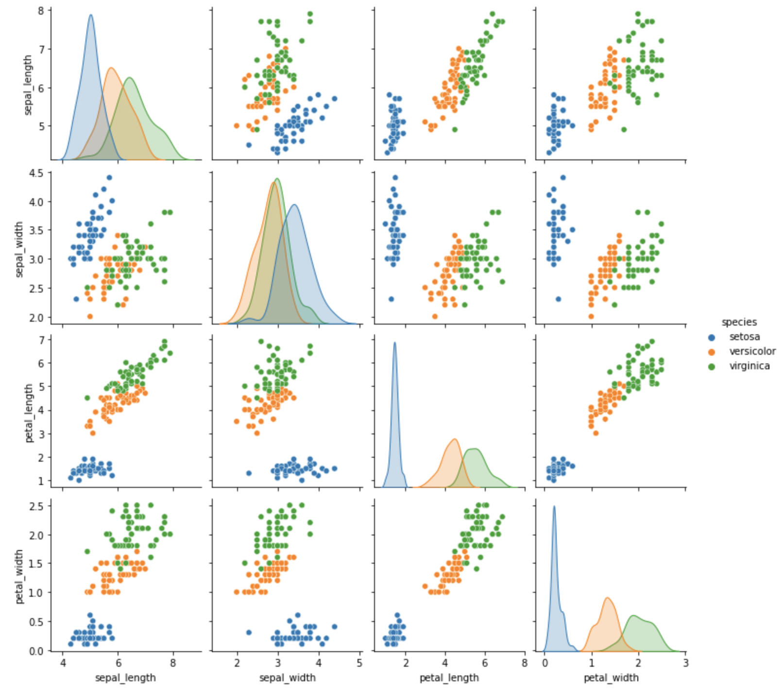

---
author:
- Nathan Hughes
title: Introduction to modelling and programming
---

# Setup

In this session we will be using the Python programming language. To
avoid having to install anything, and for a quick start, we will be
using <https://colab.research.google.com/>. Colaboratory is a service
offered by Google that allows running Python (and some other languages)
code remotely. If you're interested in continuing with anything covered
in this session then [Anaconda](https://www.anaconda.com) is a very
simple, user-friendly, method of installing Python onto your own
computer.

**Before this session**, please ensure that you can do the following:

1.  Go to <https://colab.research.google.com/> and sign-in (can use your
    own Google account or create a new one if needed).

2.  Go to file $\rightarrow$ new notebook.

3.  You'll now see an empty file, there will be a blank box. Into this
    box type \"print('hello world!')\".

4.  Press the run button and check that it properly prints out your
    message.

{width="60%"}

# Introduction to Python

Python is an example of an \"interpretive\" programming language. This
means that it runs exactly what it's told to, when it's told to. This
makes it ideal for modelling and exploring data as we do not need to
plan out exactly what we want to do with the data as we are working with
it.

Before we begin with using data and doing any modelling, we must first
learn some basics of how to use Python.

## Basic mathematics operations

If we followed the setup section properly we will have what is called a
\"Python Notebook\" in front of us. This allows us to type some code
into a box then hitting run to get some results. Starting off simple we
can delete anything which was previously in the box and type some basic
maths operations such as:

Addition:

``` {.python language="Python"}
1+1
```

Subtraction:

``` {.python language="Python"}
1-1-1-1
```

Multiplication and division:

``` {.python language="Python"}
10*10/5
```

Powers:

``` {.python language="Python"}
10**2
```

Also, please notice that order of operations matter, just like in maths.
If you want to specify operations you can always add \"()\".

## Variables

In most programming languages it is important to consider what kind of
data you are using e.g. is it text, integer values, floating point
values, etc. Python is pretty smart and lets you move between these
types vary easily and without specifying explicitly what you want. For
example we can make a named variable like so:

``` {.python language="Python"}
    i = 10
```

Then do some operations on it:

``` {.python language="Python"}
    i + 5
```

Or even change it and check it again (notice what happens, and is it
what you expected to happen?):

``` {.python language="Python"}
    i = i + i 
    print(i)
```

Using variables makes it easier to generalise code:

``` {.python language="Python"}
    x = 5
    y = 10
    z = 20

    volume = x * y * z
    print(volume)
```

## Making and using functions

The real power of programming solutions is really the ability to create
reproducible results. As scientists, it is critical that our code always
give the same results when given the same input. In Python, we can
create functions which allow us to make code reusable and to save
copying and pasting and possibly making mistakes. To create a function
we use the word \"def\" followed by whatever name we want to use, some
\"()\" which will include the parameters of the function, a \":\" and
then under all that the actual function itself.

``` {.python language="Python"}
    def myFirstFunction(a):
        return a*2
```

With this example we created a function called \"myFirstFunction\" which
takes one parameter \"a\" and returns a value twice that of \"a\".
Notice that running a block with this code will not do anything. That's
because we haven't actually used it. This is exactly the same as
$f(a) = 2a$, if you want to think of it more mathematically.

To use this function we need to call it, so creating a new code box with
the \"+\" button we can now try:

``` {.python language="Python"}
myFirstFunction(5)
```

You may have noticed by calling \"myFirstFunction\" looks similar to the
\"print(x)\" command, and it is, they're both functions in python.

We can use functions within functions to make more complicaticated
behaviours:

``` {.python language="Python"}
    def volumeOfCuboid(x,y,z):
        print("X is equal to", x)
        print("Y is equal to", y)
        print("Z is equal to", z)
        print("----")
        volume = x*y*z
        print("Volume is":)
        print(volume)
        return volume

    volumeOfCuboid(10,20,30)
    
    a = 5
    b = 10
    c = 2

    volumeOfCuboid(a,b,c)
```

## Lists, dictionaries and Loops

So far we have used small variables such as $x=10$, but often we want to
work with a series of values such as $X = [1,2,3,4,5]$. In Python the
basic way to do this is with \"lists\", in the next section we will talk
about \"arrays\", take note that there is a difference.

We can make a basic list like this:

``` {.python language="Python"}
    myShoppingList = ['milk', 'bread', 'tofu']
    print(myShoppingList)
```

and also add to the list like this, using the \".append\" function:

``` {.python language="Python"}
    myShoppingList = ['milk', 'bread', 'tofu']
    print(myShoppingList)
    print('Opps I forgot to add apples')
    myShoppingList.append('apples')
    print(myShoppingList)
```

Lists are ordered and indexed, meaning we can access just a selection if
we want:

``` {.python language="Python"}
    myShoppingList = ['milk', 'bread', 'tofu']

    print("the first thing in my list is")
    print(myShoppingList[0])
```

Notice that we begin counting the list at \"0\" and not \"1\".

Python also makes it very easy to loop over lists. Look at the following
code and think what it's doing. The value \"i\" can be anything, I just
named it 'i\" for an example. Also, notice the indentation of the list:

``` {.python language="Python"}
    myShoppingList = ['milk', 'bread', 'tofu']

    for i in myShoppingList:
        print(i)
```

Another kind of list-like structure in Python is a \"dictionary\". It is
somewhat similar to a list only it doesn't have to be numbers indexing
it. For example:

``` {.python language="Python"}
    Ages = {"Ben" : 10, "Spider-man": 34, "Claire": 24}
    print(Ages["Ben"])
```

Adding to dictionaries is a little different too:

``` {.python language="Python"}
    Ages = {"Ben" : 10, "Spider-man": 34, "Claire": 24}

    print("ahh, we forgot to get Tom's age")
    Ages['Tom'] = 17

    print(Ages)
```

## Importing libraries Numpy and Matplotlib

One of the most commonly used libraries in Python is called \"numpy\" it
allows for some pretty cool mathematical functionality. To import a
library (if you're running this on your own computer you may need to
install first, but on Colaboratory it should already be installed).

For example, if we want a function to square root a number we can first
import the numpy library and then do a \".\" to access its 'sqrt\"
function. The \".\" basically can be thought of as saying \"within\", so
\"within numpy\" use \"sqrt\".

``` {.python language="Python"}
    import numpy 

    i = 100 
    numpy.sqrt(i)
```

We use numpy a lot, so to make it a little shorter to type we can change
this to use an alias of \"np\". Look how this example is different:

``` {.python language="Python"}
    import numpy as np 

    i = 100 
    np.sqrt(i)
```

With numpy we can work with what is called an array, these a similar to
matricies in mathematics, but can be N-dimensional. For example a 1-D
array we can make like this:

``` {.python language="Python"}
    myArray = np.arange(1,10)
    print(myArray)
```

Now with numpy we can quickly generate some arrays we may want to stop
looking at just text and think about it in plots and figures using
matplotlib:

``` {.python language="Python"}
    import matplotlib.pyplot as plt 
    import numpy as np 

    Xs = np.arange(0,10)
    sin_values = []
    for v in Xs:
        sin_values.append(np.sin(v))

    plt.plot(Xs, sin_values)
```

**Stop here:** we've just put together a lot of things, and it's very
important at this point that we look at each line and ensure we know
what it's doing. You don't have to understand perfectly, but realise
what each line is adding and why it is needed.

So, if you've got this plot to work you may think it looks a little
clunky, let's do a few things to tidy it up:

``` {.python language="Python"}
    import matplotlib.pyplot as plt 
    import numpy as np 

    sin_values = []
    Xs = np.linspace(0,10, num=1000)
    for x in Xs:
        sin_values.append(np.sin(x))
    plt.plot(Xs, sin_values)
    plt.xlabel('x')
    plt.ylabel('sin(x)')
    plt.grid()
```

Once again, look at what we've added and changed. The new function of
\"np.linspace\", try Googling this and see if you can read and
understand what this function does.

## Testing your knowledge

Before we move onto actually modelling here is a short challenge which
you should be able to do with a little bit of thought and maybe a small
Google search.

You must make a new plot, on this plot you will first plot
$2 \times \sin(x)$ values for 0 to 100 and then on the same figure plot
the values of $\sqrt[3]{\sin(x)}$ for the same range. Bonus points if
you can add a label to these lines. An example solution can be found at
the back of this booklet.

{width="60%"}

## Bonus round: can you debug this

Here are some examples of almost working code, can you tell what is
wrong and fix it so that it works?

``` {.python language="Python"}
    X = 
    print(X)
```

``` {.python language="Python"}
    X = 10
    print(X
```

``` {.python language="Python"}
    def f(x):
        print(y)

    f(10)
```

``` {.python language="Python"}
    a = "a"
    b = 6

    a+b
```

# The Iris dataset

The [Iris data set](https://en.wikipedia.org/wiki/Iris_flower_data_set)
is a multivariate data set introduced by Ronald Fisher. It consists of
measurements of sepal length, sepal width, petal length and petal width
for three species of Iris plants, *Iris setosa, Iris versicolor* and
*Iris Virginica*. This data set contains 50 measurements for each
species and is often used for data science / modelling examples.

{width="70%"}

## Loading and exploring data

Again, speed and efficency of our time, is the name of the game here so
we're going to introduce two new libraries to help us get our hands on
this data set and explore it:

``` {.python language="Python"}
    import seaborn as sns 
    import pandas as pd

    df=sns.load_dataset('iris')
    df.head()
```

Seaborn is a package which makes matplotlib a little quicker to use, and
pandas is a beautiful little library for working with tables of data. We
call these tables \"Dataframes\" which is why we abbreviate the data to
\"df\" for quickness. Calling the \".head()\" function on the Dataframe
gives us a quick look at the first few rows of data.

  ------- ------------------ ----------------- ------------------ ----------------- -------------
            **sepal_length**   **sepal_width**   **petal_length**   **petal_width**   **species**
   **0**                 5.1               3.5                1.4               0.2        setosa
   **1**                 4.9               3.0                1.4               0.2        setosa
   **2**                 4.7               3.2                1.3               0.2        setosa
   **3**                 4.6               3.1                1.5               0.2        setosa
   **4**                 5.0               3.6                1.4               0.2        setosa
  ------- ------------------ ----------------- ------------------ ----------------- -------------

With these data and pandas we can do some very quick and very useful
analysis. For example, if we want to check the mean of all columns:

``` {.python language="Python"}
df.mean()
```

Alternatively, we can use another handy function called \"describe\"
like so:

``` {.python language="Python"}
df.describe()
```

  ----------- ------------------ ----------------- ------------------ ----------------- --
                **sepal_length**   **sepal_width**   **petal_length**   **petal_width** 
   **count**          150.000000        150.000000         150.000000        150.000000 
   **mean**             5.843333          3.057333           3.758000          1.199333 
    **std**             0.828066          0.435866           1.765298          0.762238 
    **min**             4.300000          2.000000           1.000000          0.100000 
    **25%**             5.100000          2.800000           1.600000          0.300000 
    **50%**             5.800000          3.000000           4.350000          1.300000 
    **75%**             6.400000          3.300000           5.100000          1.800000 
    **max**             7.900000          4.400000           6.900000          2.500000 
  ----------- ------------------ ----------------- ------------------ ----------------- --

## Plotting data

This is nice and all, but what about making some nicer summary plots,
boxplots for example, are a nice way to show distributions:

``` {.python language="Python"}
sns.boxplot(data=df, x='species', y='petal_width')
```

{width="70%"}

We're still thinking quite small scale with this figure, so let's take a
look at the data as a whole:

``` {.python language="Python"}
sns.pairplot(data=df, hue='species')
```

{width="90%"}

## Statistical testing

Often, you will just want to know if \"A is different from B\", in
Python this is fairly straight-forward. However, first you need to
decide which test to do on your data to give the most appropriate
results. Examples given here are heavily inspired by a great article
which can be found here:
<https://machinelearningmastery.com/statistical-hypothesis-tests-in-python-cheat-sheet/>

### Shapiro-Wilk Test

The Shapiro-Wilk test will allow you to determine if your data fits a
Normal distribution. Thus, our null hypothesis becomes \"our data has a
normal distribution\".

``` {.python language="Python"}
    from scipy import stats
    setosa = df['species'] == 'setosa'
    setosa_sepal_length = df[setosa]['sepal_length']

    stats.shapiro(setosa_sepal_length)
```

Check the output of this command. It would suggest that the data are
quite normally distributed so we can again visually check if we would
like.

``` {.python language="Python"}
plt.hist(setosa_sepal_length)
```

{width="40%"}

Optionally, you can try and repeat this to check another species or
another feature to see if it is also normally distributed.

### Student's t-Test

Having evaluated our data and how 'normal' it is, we can proceed to
choosing a statistical test. Most commonly used to biology, regardless
of how correct or appropriate it is
(<https://www.statisticsdonewrong.com>, this is an excellent read, very
funny and requires little maths experience), is the t-test. More
specifically Student's t-test.

Here, we perform a t-test between the sepal length of setosa and
virginica plants.

``` {.python language="Python"}
    from scipy import stats
    setosa = df['species'] == 'setosa'
    virginica = df['species'] == 'virginica'
    setosa_sepal_length = df[setosa]['sepal_length']
    virginica_sepal_length = df[virginica]['sepal_length']
    stats.ttest_ind(setosa_sepal_length, virginica_sepal_length, equal_var=False)
```

The first value returned is the t-statistic and the second, the commonly
reported, p-value.

## Building and testing a simple linear model

For modelling, let's start simple. If we look at the previous plot we
might be inclined to think that \"petal_length\" and \"petal_width\"
have a linear relationship. So let us build a simple model using,

$$y = mx+b.$$

Using another library this time, scipy, we can quite quickly find the
ideal parameters for $m$ and $b$ in this model. We define our function
\"linear\" to take an $x,m$ and $b$ and return a $y$ value. We specify
our \"xdata\" and \"ydata\" to be \"petal_length\" and \"petal_width\",
respectively. Then putting together with \"curve_fit\" we get a \"pars\"
list. This \"pars\" variable is just the $m$ and $b$ values for the
model.

``` {.python language="Python"}
    from scipy.optimize import curve_fit

    def linear(x,m,b):
      return m*x+b
    
    xdata = df['petal_length']
    ydata = df['petal_width']
    
    pars, cov = curve_fit(f=linear, xdata=xdata, ydata=ydata)
```

Now, if we take those $m,b$ values we should be able to make a fairly
decent prediction of \"petal_width\" given the \"petal_length\", if our
assumption of linearity is apt. Remember, pars is a list of two values,
so we need to pass it to our linear function correctly:

``` {.python language="Python"}
    Y_pred = [ ]

    for x in xdata:
      Y_pred.append(linear(x, pars[0], pars[1]))
    
    plt.scatter(xdata, ydata, c='r')
    plt.plot(xdata, Y_pred)
    plt.xlabel('petal_length')
    plt.ylabel('petal_width')
```

{width="70%"}

This looks like a pretty good fit, but let's put some numbers behind it
by calculating the $R^2$ value (calculated using [Coefficient of
determination](https://en.wikipedia.org/wiki/Coefficient_of_determination)):

``` {.python language="Python"}
    residuals = ydata- linear(xdata, pars[0], pars[1])
    ss_res = np.sum(residuals**2)
    ss_tot = np.sum((ydata-np.mean(ydata))**2)
    r_squared = 1 - (ss_res / ss_tot)
    print(r_squared)
```

# Test solution

``` {.python language="Python"}
import matplotlib.pyplot as plt 
import numpy as np 

sin2_values = []
sin3_values = []
Xs = np.linspace(0,10, num=1000)

for x in Xs:
    sin2_values.append(np.sin(x)*2 )
    sin3_values.append(np.cbrt(np.sin(x)))

plt.plot(Xs, sin2_values, label="2 sin(x)")
plt.plot(Xs, sin3_values, label='cbrt(sin(x))')
plt.xlabel('x')
plt.ylabel('sin(x)')
plt.legend()
plt.grid()
```
